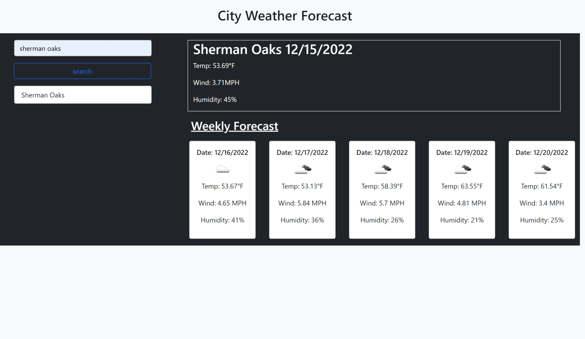

# Weather4U

##Description
This webpage was created to allow users to search any city's 5 day weather forecast. The page uses HTML CSS and JavaScript to allow this dynamic functionality. Users' recent searches will be saved as buttons so they can easily access the weather again when they choose to. 

## Installation

N/A

## Usage
To use this page the user will fill the "City" input area. The user will then press "Search" to see the results. Upon clicking "Search", the user will be presented with 5 days worth of weather information including temperature, humidity, and wind speed. The users' city search will be saved on the left as a button. If the user ever wishes to see the weather for that same city, they can press on the button with the city name they want and the corelating weather will appear again.

##Deployment Link
https://yacovkopel.github.io/Weather4U!/

